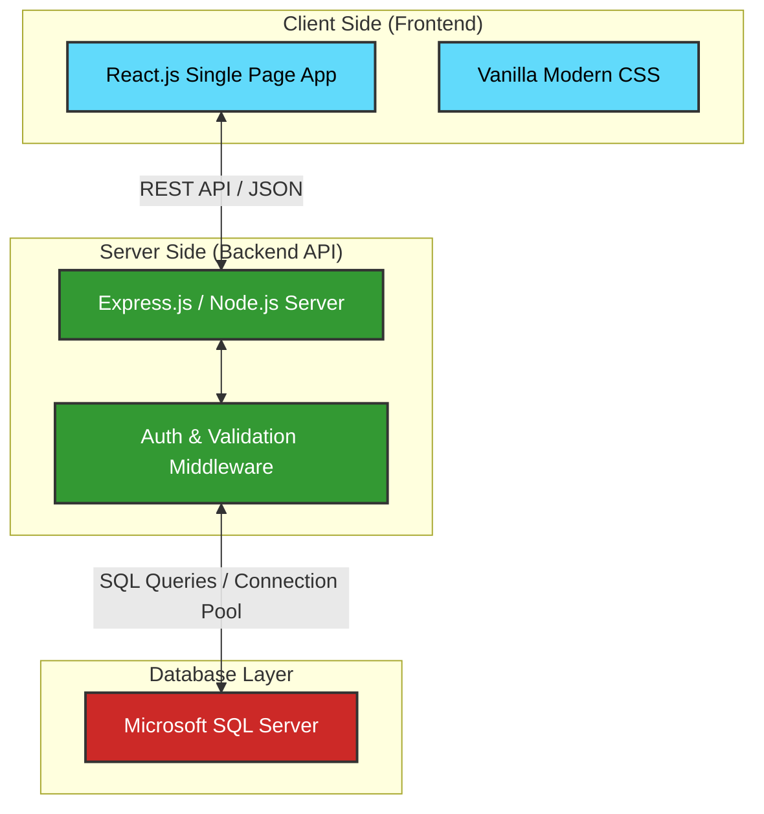
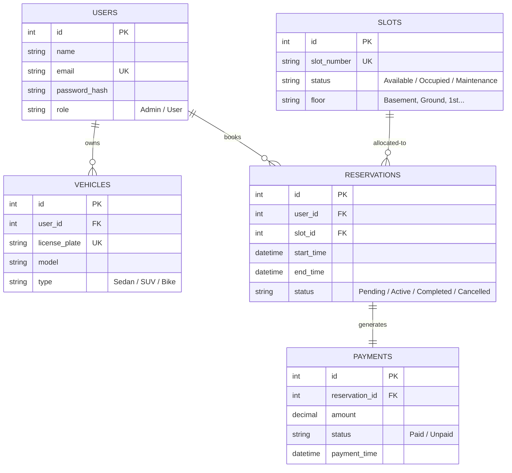

# 🚗 Car Parking Management System

[](https://react.dev/)
[](https://nodejs.org/)
[](https://expressjs.com/)
[](https://www.microsoft.com/en-us/sql-server)
[](LICENSE)

A modern, full-stack **Car Parking Management System** designed to streamline vehicle parking operations, automate slot allocation, and manage reservations in real-time. Built using React.js for a dynamic user interface, Express & Node.js for backend orchestration, and SQL Server for secure, relational data storage.

---

## 🌟 Key Features

*   🔐 **Secure Authentication & Roles:** Dual-portal system supporting both **Administrators** (management console) and **Drivers/Users** (booking portal).
*   🚗 **Vehicle Registration:** Seamless management of multiple vehicles per user account.
*   ⏱️ **Real-Time Booking:** Reserve parking slots for specific hours with automated real-time availability checks.
*   💰 **Automated Fare Calculation:** Integrated pricing engine that calculates parking fees based on duration and vehicle type.
*   📊 **Interactive Dashboard:** Visual mapping of occupied, reserved, and free parking spots.
*   📝 **Audit Logging & History:** Comprehensive entry/exit logs and payment history tracking.

---

## 🏗️ System Architecture



---

## 💾 Database Schema

The database model is optimized for transactional reliability and quick retrieval of parking slot status.



---

## 📂 Project Structure

```directory
Car-Parking-Management-System/
├── backendforcarparkingsystem/       # Node.js + Express backend
│   ├── package.json                  # Backend dependencies
│   └── server.js                     # Server entry point & API routes
│
├── frontendforcarparkingsystem/      # React.js frontend
│   ├── public/                       # Static public assets
│   ├── src/                          # React components & logic
│   │   ├── App.js                    # Main component
│   │   ├── App.css                   # Stylesheet
│   │   ├── index.js                  # Frontend entry point
│   │   └── index.css                 # Global modern CSS variables
│   └── package.json                  # Frontend dependencies
│
└── package.json                      # Root package.json (dev config)
```

---

## ⚡ Quick Start

### Prerequisites
Before running the application, make sure you have the following installed:
*   [Node.js](https://nodejs.org/) (v16 or higher)
*   [Microsoft SQL Server](https://www.microsoft.com/en-us/sql-server)
*   [Git](https://git-scm.com/)

---

### Step 1: Database Setup
1.  Open **SQL Server Management Studio (SSMS)**.
2.  Create a new database named `CarParkingDB`.
3.  Execute your table creation scripts or run migrations based on the [Database Schema](#-database-schema) definitions.

---

### Step 2: Backend Setup
1.  Navigate to the backend directory:
    ```bash
    cd backendforcarparkingsystem
    ```
2.  Install dependencies:
    ```bash
    npm install
    ```
3.  Create a `.env` file in the backend root directory:
    ```env
    PORT=5000
    DB_USER=your_sql_user
    DB_PASSWORD=your_sql_password
    DB_SERVER=localhost
    DB_DATABASE=CarParkingDB
    JWT_SECRET=your_jwt_secret_key
    ```
4.  Start the Express development server:
    ```bash
    node server.js
    ```
    *The server will run on `http://localhost:5000`*

---

### Step 3: Frontend Setup
1.  Open a new terminal and navigate to the frontend directory:
    ```bash
    cd frontendforcarparkingsystem
    ```
2.  Install dependencies:
    ```bash
    npm install
    ```
3.  Start the React app:
    ```bash
    npm start
    ```
    *The application will open automatically on `http://localhost:3000`*

---

## 🔌 API Endpoints (Planned & Drafted)

| Endpoint | Method | Description | Auth Required |
| :--- | :---: | :--- | :---: |
| `/api/auth/register` | `POST` | Registers a new user | No |
| `/api/auth/login` | `POST` | Authenticates user & returns JWT | No |
| `/api/slots` | `GET` | Retrieves all parking slots and statuses | Yes |
| `/api/slots/reserve` | `POST` | Books a parking slot for a duration | Yes |
| `/api/reservations/user` | `GET` | Fetches active bookings for the logged-in user | Yes |
| `/api/payments/checkout` | `POST` | Processes parking fee payments | Yes |
| `/api/message` | `GET` | Diagnostic endpoint to verify API connection | No |

---

## 🤝 Contributing

Contributions are what make the open source community such an amazing place to learn, inspire, and create. Any contributions you make are **greatly appreciated**.

1. Fork the Project
2. Create your Feature Branch (`git checkout -b feature/AmazingFeature`)
3. Commit your Changes (`git commit -m 'Add some AmazingFeature'`)
4. Push to the Branch (`git push origin feature/AmazingFeature`)
5. Open a Pull Request

---

## 📄 License

Distributed under the MIT License. See `LICENSE` for more information.
